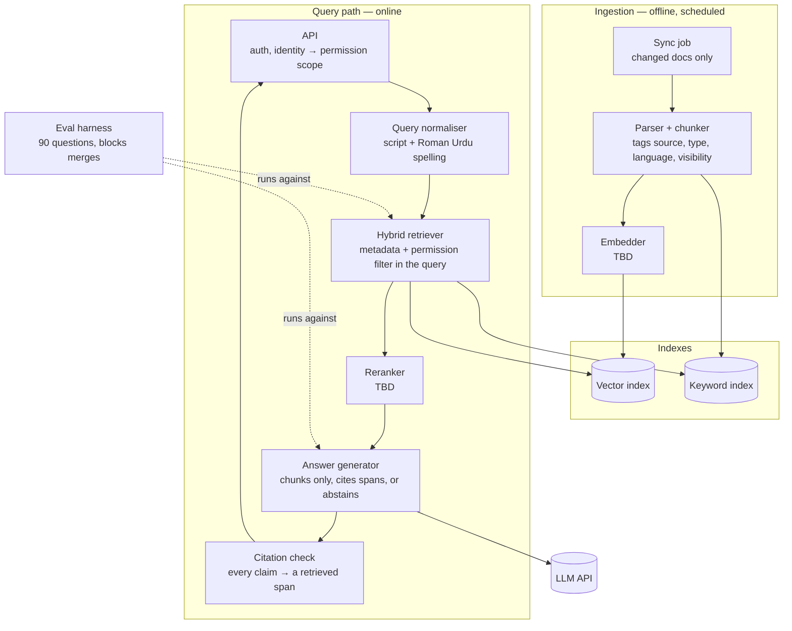

# Design

## Context

```mermaid
flowchart LR
    Customer([Customer<br/>English · Urdu · Roman Urdu])
    Staff([Support staff<br/>internal questions])

    System[[Knowledge Assistant]]

    Store[(Store content<br/>product pages, returns policy,<br/>shipping tables)]
    Support[(Past support<br/>conversations)]
    Orders[(Order system<br/>per-customer orders)]
    LLM[(LLM API<br/>TBD)]

    Customer -- question --> System
    System -- cited answer or<br/>"I don't have that" --> Customer
    Staff -- question --> System
    System -- cited answer --> Staff

    Store -- scheduled sync --> System
    Support -- scheduled sync --> System
    Orders -- scoped reads --> System
    System -- prompt with retrieved chunks --> LLM
```

## Containers



## Data flow

1. **Sync:** A scheduled job pulls store content, support conversations and order records, and processes only documents that changed since the last run.
2. **Parse and chunk:** Each document is split into chunks. Every chunk is tagged with `source`, `doc_type` (product, policy, shipping, support, order), `language` (en, ur, roman-ur), `updated_at`, and `visibility` (`public`, `staff`, or `customer:<id>`).
3. **Index:** Chunks are embedded into the vector index and added to the keyword index. Edited or deleted documents replace or remove their old chunks.
4. **Ask:** A customer or staff member asks a question. The API resolves who is asking and turns that into a permission scope: public only, public + own orders, or staff.
5. **Normalise:** The query is tagged by script. Roman Urdu spelling variants ("razai / rajai / rezai") are expanded or normalised.
6. **Retrieve:** Hybrid search runs across both indexes. **The permission scope and metadata filters are part of the query itself**, so chunks the asker can't see are never fetched.
7. **Rerank:** Candidates are reranked for relevance, and the top *k* are kept.
8. **Generate:** The model gets instructions, then the chunks inside delimited data blocks, then the question. It answers only from those chunks and cites exact source spans. If the chunks don't contain the answer, it says so.
9. **Verify:** Every citation is checked against a span that was actually retrieved. An uncited or mis-cited claim turns the answer into an abstention.
10. **Return:** The answer and its citations go back to the asker, and a redacted trace is logged.
11. **Measure:** Every change runs against the 90-question eval set. A drop in Hit rate@5, Recall@5 or MRR blocks the merge.

## Trust boundaries

- **Customer order data is retrievable only by that customer.**
  The asker's scope comes from the authenticated identity, never from the question or
  the model's output. It is applied as a filter inside the retrieval query, before
  ranking. Filtering results afterwards doesn't count.
- **Retrieved content is data, never instructions to the model.**
  Chunks go into the prompt as quoted, delimited data. Text inside a product page or a
  support chat that reads like an instruction ("ignore the above…") is treated as
  content. Nothing retrieved can change the scope, the tools, or the system prompt.
- **Past support conversations are private by default.**
  They are tagged `staff` or `customer:<id>`, never `public`. Names, phone numbers and
  addresses are redacted before indexing, unless the chunk's visibility is limited to
  that customer.
- **Answers come only from the corpus.**
  The model's general knowledge is not a source. When the retrieved chunks don't contain
  the answer, the result is "I don't have that information", not a guess.
- **Personal data never enters the public repository.**
  The eval set, fixtures, example chunks and logs that get committed use synthetic or
  anonymised text. Raw support exports stay outside the repository.

## Non-goals

- Answering from the model's general knowledge.
- Showing any customer another customer's data.
- Following instructions found in retrieved content.
- Being a general-purpose assistant.
- Replacing the support team.

## Open questions

1. **Roman Urdu spelling:** Should variants be handled by a normalisation dictionary, transliteration to Urdu script, character n-gram keyword search, or leaving it to the embeddings? How much does each one move Recall@5?
2. **Embedding model:** Which model handles English, Urdu script and Roman Urdu in one vector space well enough for cross-lingual questions, such as an English question with an Urdu answer?
3. **Chunking by document type:** Do product pages, the returns policy, shipping tables and chat transcripts need different chunking? How do we chunk a table so one row still makes sense on its own?
4. **Freshness:** How often does the sync run, and how stale can price and stock be? Should anything that changes daily be queried live instead of indexed?
5. **Customer identity:** How does a customer prove who they are before any order data is in scope: order number plus phone, an OTP, or an account?
6. **Support conversations:** Should past chats be indexed at all, or only mined for FAQs and eval questions? If indexed, how are they redacted and scoped?
7. **Hybrid fusion and reranker:** How are keyword and vector results combined (reciprocal rank fusion or weighted), and is a multilingual reranker worth the added delay?
8. **Abstention threshold:** When does the system say "I don't have that"? A retrieval-score cutoff, a failed citation check, or both? How is it measured on the unanswerable part of the eval set?

## Candidate decisions (for DECISIONS.md)

- Permissions are enforced inside the retrieval query, not after it and not by the model.
- The permission scope comes from the authenticated identity only.
- Retrieval is hybrid (vector + keyword), because Roman Urdu spelling defeats either one alone.
- Answers must cite retrieved spans, and anything uncited becomes an abstention.
- Support conversations are private by default and redacted before indexing.
- The eval set gates merges, and every stack choice is justified by eval numbers.
